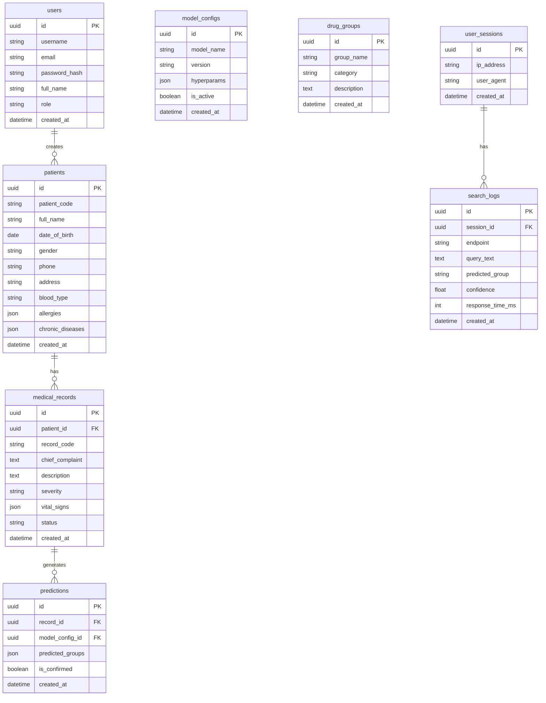

# Database Schema - Drug-Pred AI

Dự án sử dụng PostgreSQL làm hệ quản trị cơ sở dữ liệu chính.
SQLAlchemy được dùng làm ORM trong FastAPI.

## 1. Sơ đồ thực thể (Entity Relationship Diagram - ERD)

## 2. Mô tả các bảng chính

1.  **users**: Quản lý tài khoản bác sĩ, admin truy cập hệ thống.
2.  **patients**: Thông tin hồ sơ y tế bệnh nhân (mã định danh, thông tin liên lạc, dị ứng).
3.  **medical_records**: Hồ sơ khám bệnh lâm sàng của bệnh nhân (triệu chứng, chẩn đoán sơ bộ, sinh hiệu).
4.  **predictions**: Kết quả dự đoán nhóm thuốc được sinh ra bởi AI cho mỗi `medical_record`.
5.  **drug_groups**: Danh mục nhóm thuốc chuẩn (phân loại theo Taxonomy y khoa).
6.  **model_configs**: Quản lý phiên bản và cấu hình của các mô hình AI.
7.  **search_logs** & **user_sessions**: Lưu trữ log dự đoán để phục vụ Dashboard Analytics.

## 3. Database Migration
Dự án sử dụng **Alembic** để quản lý version của database:
- Tạo migration mới: `alembic revision --autogenerate -m "Message"`
- Áp dụng migration: `alembic upgrade head`
