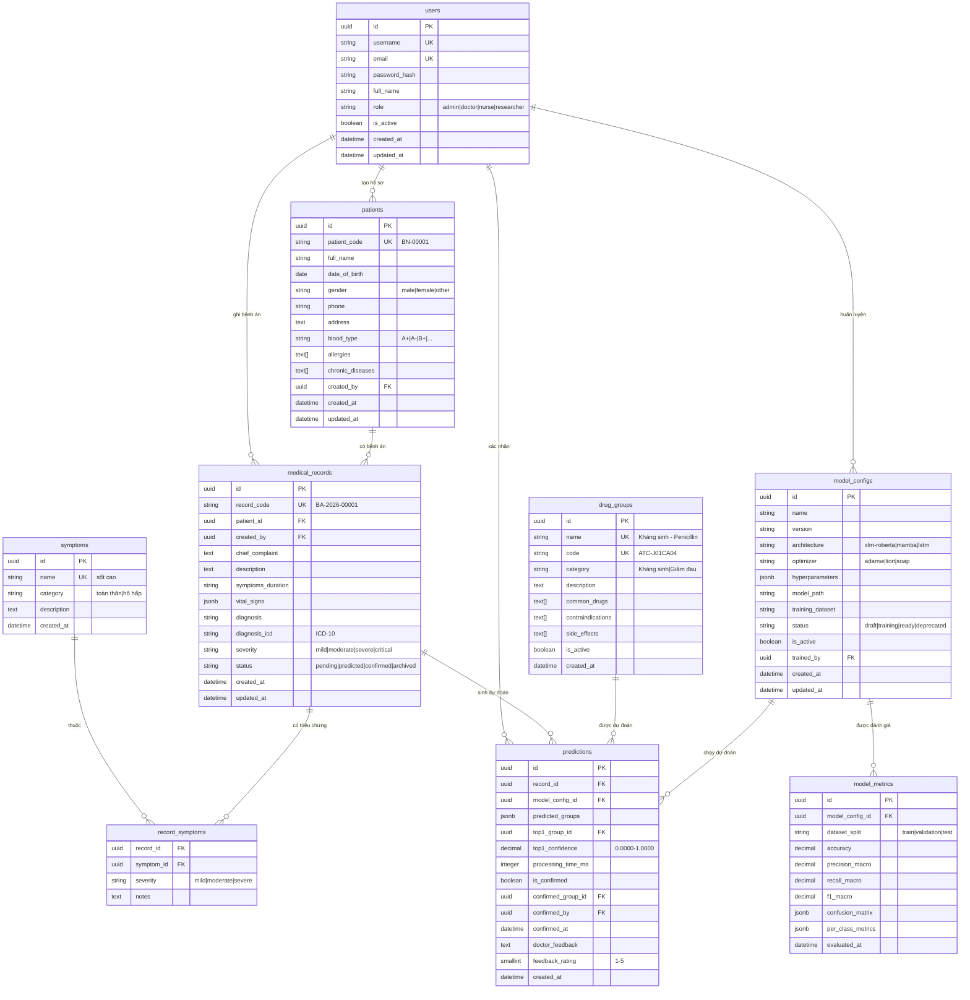

# Database Schema - Drug-Pred AI

Dự án sử dụng PostgreSQL làm hệ quản trị cơ sở dữ liệu chính.
SQLAlchemy được dùng làm ORM trong FastAPI.

## 1. Sơ đồ thực thể (Entity Relationship Diagram - ERD)



## 2. Mô tả các bảng chính

| # | Bảng | Chức năng |
|---|------|-----------|
| 1 | **users** | Quản lý tài khoản bác sĩ, điều dưỡng, admin; lưu mật khẩu hash và phân quyền. |
| 2 | **patients** | Thông tin hồ sơ y tế bệnh nhân: mã BN, ngày sinh, nhóm máu, dị ứng, bệnh mãn tính. |
| 3 | **symptoms** | Danh mục triệu chứng lâm sàng chuẩn hóa (sốt, ho, đau đầu, ...) phân theo nhóm cơ thể. |
| 4 | **medical_records** | Bệnh án: triệu chứng chính, mô tả lâm sàng, sinh hiệu (JSONB), chẩn đoán ICD-10. |
| 5 | **record_symptoms** | Bảng liên kết N:N giữa bệnh án và danh mục triệu chứng, ghi nhận mức độ mỗi triệu chứng. |
| 6 | **drug_groups** | Danh mục nhóm thuốc đích (13 nhóm), bao gồm ATC code, thuốc thường dùng, chống chỉ định. |
| 7 | **model_configs** | Cấu hình và siêu tham số mô hình AI (architecture, optimizer, hyperparameters). |
| 8 | **predictions** | Kết quả dự đoán Top-N từ AI, kèm xác nhận và phản hồi của bác sĩ. |
| 9 | **model_metrics** | Lịch sử đánh giá chất lượng mô hình: accuracy, F1 macro, per-class metrics. |

## 3. Indexes và Mục đích

| Bảng | Index | Mục đích |
|------|-------|----------|
| users | `idx_users_role` | Lọc nhanh theo vai trò |
| users | `idx_users_email` | Đăng nhập, tìm theo email |
| users | `idx_users_active` | Chỉ query user đang hoạt động |
| patients | `idx_patients_code` | Tra cứu BN theo mã |
| patients | `idx_patients_name` | Tìm kiếm BN theo tên |
| patients | `idx_patients_dob` | Lọc theo ngày sinh/tuổi |
| medical_records | `idx_records_patient` | Load bệnh án của 1 BN |
| medical_records | `idx_records_status` | Lọc bệnh án pending/confirmed |
| medical_records | `idx_records_icd` | Tìm theo mã ICD-10 |
| medical_records | `idx_records_created` | Sort bệnh án mới nhất trước |
| predictions | `idx_predictions_record` | Load dự đoán của 1 bệnh án |
| predictions | `idx_predictions_model` | Thống kê theo version model |
| predictions | `idx_predictions_top1` | Phân phối nhóm thuốc dự đoán |
| predictions | `idx_predictions_created` | Sort dự đoán mới nhất trước |
| model_configs | `idx_model_configs_active` | UNIQUE — chỉ 1 model active |
| model_metrics | `idx_metrics_model` | Load metrics của 1 model |

## 4. Script tạo cơ sở dữ liệu

File `schema.sql` ở thư mục gốc chứa toàn bộ DDL để khởi tạo database:

```bash
# Sử dụng Docker Compose (khuyến nghị)
docker compose up -d postgres
docker compose exec postgres psql -U admin -d pj_medicine -f /schema.sql

# Hoặc chạy trực tiếp
psql -U admin -d pj_medicine -f schema.sql
```

## 5. Database Migration

Dự án sử dụng **Alembic** để quản lý version của database:
```bash
# Tạo migration mới
alembic revision --autogenerate -m "Mô tả thay đổi"

# Áp dụng migration lên DB
alembic upgrade head

# Xem lịch sử migration
alembic history
```

Xem chi tiết Data Dictionary tại: [DATA_DICTIONARY.md](DATA_DICTIONARY.md)

Xem Mapping User Story → Database tại: [USER_STORY_DB_MAPPING.md](USER_STORY_DB_MAPPING.md)
